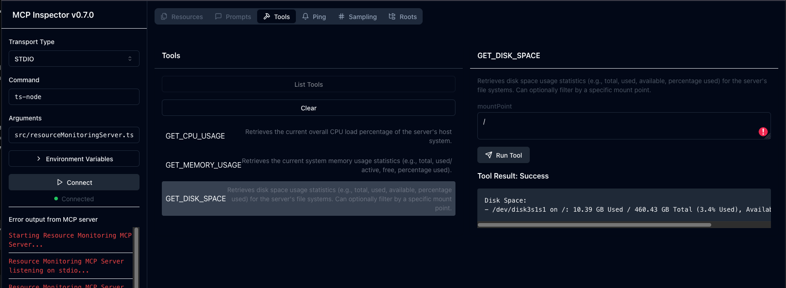
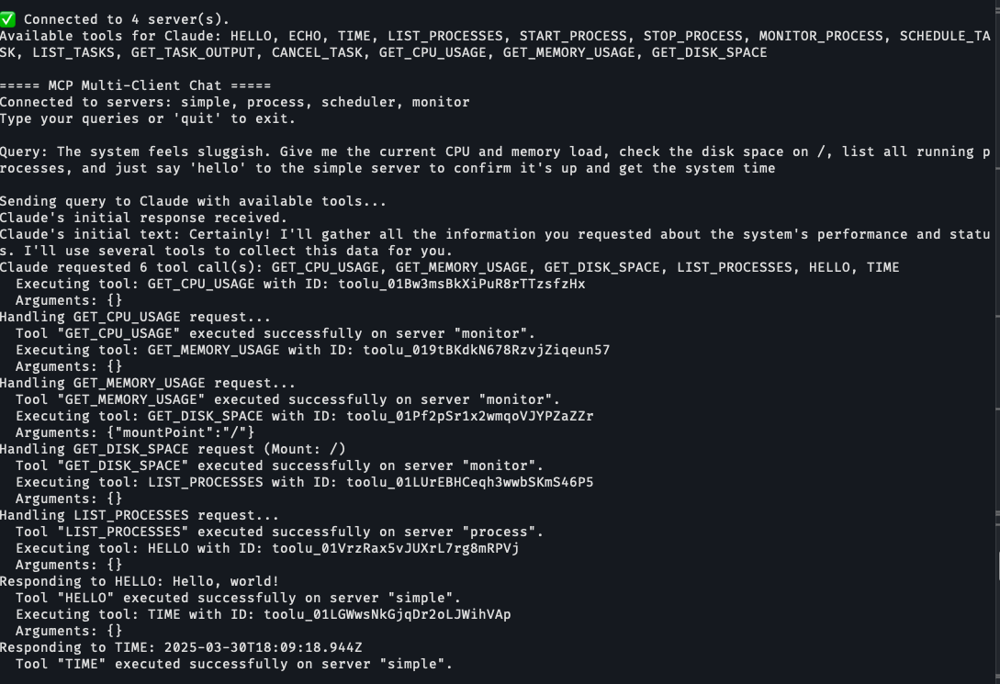

# MCP Servers

## Overview

This project includes multiple MCP (Model Context Protocol) servers, each designed to demonstrate specific tasks such as simple interactions, process control, task scheduling, and resource monitoring.





## Features

- **Simple Server**: Handles basic commands like greetings and echo.
- **Process Control Server**: Manages system processes, including listing, starting, stopping, and monitoring processes.
- **Task Scheduling Server**: Schedules and manages tasks using cron-like syntax.
- **Resource Monitoring Server**: Monitors system resources like CPU, memory, and disk usage.

## Installation

1. Clone the repository:
    ```sh
    git clone https://github.com/yourusername/mcp-servers.git
    cd mcp-servers
    ```

2. Install dependencies:
    ```sh
    npm install
    ```

## Configuration

Create a `mcp-servers.json` file to configure your MCP servers:
```json
{
   "mcpServers": {
      "simple": {
         "command": "node",
         "args": [
            "/absolute/path/dist/simpleServer.js"
         ]
      },
      "process": {
         "command": "node",
         "args": [
            "/absolute/path/dist/processControlServer.js"
         ]
      },
      "scheduler": {
         "command": "node",
         "args": [
            "/absolute/path/dist/taskSchedulingServer.js"
         ]
      },
      "monitor": {
         "command": "node",
         "args": [
            "/absolute/path/dist/resourceMonitoringServer.js"
         ]
      }
   }
}

}
```

## Demonstration
To demonstrate the four different MCP servers (simpleServer, processControlServer, taskSchedulingServer, and resourceMonitoringServer) in action, follow these steps:


### Step 1: Start the MCP Servers
Ensure that each server is running. You can start them using the commands defined in the package.json of the mcp-servers project.

```sh
npm run inspect:simple-server
npm run inspect:process-control-server
npm run inspect:task-scheduling-server
npm run inspect:resource-monitoring-server
```

### Step 2: Interact with the Servers
Use the MCPMultiClient class to connect to the servers and send queries for debugging purposes.

```sh
cd path/to/mcp-multi-client
npm run start
```

The script will:
- Load the configuration file.
- Connect to the MCP servers.
- Send example queries to each server.
- Print the responses to the console.
- Clean up and close connections.
